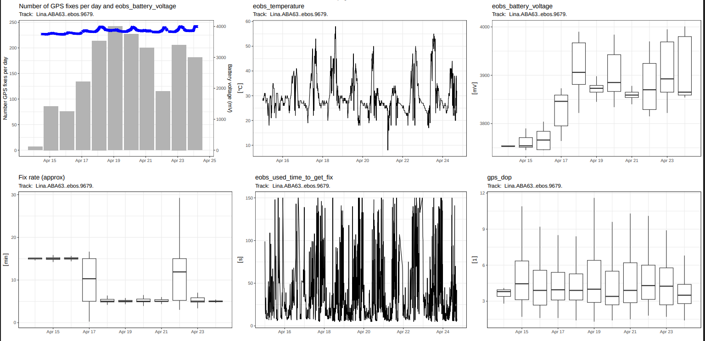

# Tag Diagnostics Plots

MoveApps

Github repository: *https://github.com/movestore/tag_diagnostics.git*

## Description
Creation of plots for diagnostics and monitoring of tags. Number of locations per day, battery voltage and fix rate, and any other attribute can be plotted

## Documentation
User has freedom to select what should be plotted. Number of locations per day is calculated from the data, and in the same plot the battery voltage can be added. The fix rate is also calculated from the data (from the time lag between consecutive locations) and represented as boxplots per day. The solid line of the boxplot corresponds to the median value which normally will correspond to the fix rate setting of the tag. Any numeric variable can be plotted as a line over time, and/or summarized as boxplots per day. All boxplots exclude the outliers for better visualization. If a line is plotted all values are included.
For better interpretation the data can be plotted in local time (timezone of the physical location of the tag).

### Output snapshot

  

### Application scope
#### Generality of App usability
This App was developed for any taxonomic group. 

#### Required data properties
The App should work for any kind of (location) data.

### Input type
`move2::move2_loc`

### Output type
`move2::move2_loc`

### Artefacts
`tag_diagnostics_plots_by_Attribute.pdf` / `tag_diagnostics_plots_by_Track.pdf`: PDF containing all plots, either grouped by attribute or by track

### Settings 

`Plot number of locations per day` (plot_nb_lcs): default: true

`To add battery voltage to previous plot choose the attibute containing battery voltage`(bat_attr_prov): dropdown with the most common attribute names for data from Movebank that contain battery voltage values. If needed attribute is not available, use free text field below. Available attibutes: "tag_voltage", "eobs_battery_voltage", "solar_cell_voltage", "battery_charging_voltage", "eobs_fix_battery_voltage", "solar_voltage_percent", "tag_backup_voltage", "tinyfox_sunny_index_start_voltage", "tinyfox_sunny_index_voltage_increase", "voltage_resolution". Default: non is selected

`OR provide column name of battery voltage in the data set to add to the previous plot if not present in the selection above` (bat_attr): Provide the exact name of the column containing the battery voltage. If unsure of attribute names or spelling, please run the first App in your workflow and check the 'event_attributes' in the 'App Output Details' (green 'i'). For definitions of Movebank attributes please refer to the [Movebank Attribute Dictionary](https://www.movebank.org/cms/movebank-content/movebank-attribute-dictionary).

`Plot fix rate (approximation)` (plot_fix_rate): Fix rate is calculated from the data by calculating the timelag between consecutive locations. These are summarized per day an visualized as a boxplot. The solid line in the middle of the box is the median fix rate calculated and mostly corresponds to the fix rate programmed on the tag. Outliers are not displayed for better visualization. Default: true

`Units to calculate fix rate` (unts_fix_rate): fix rates can be from seconds to hours or even days. For best possible viasualization the units for the fix rate can be selected. Options: "Seconds", "Minutes", "Hours", "Days". Default: Minutes

`Additional attributes to plot as lines` (attr_line): Provide the exact names of the data attributes that you want to plot as a line (must be comma-separated! and without quotes). If unsure of attribute names or spelling, please run the first App in your workflow and check the 'event_attributes' in the 'App Output Details' (green 'i'). For definitions of Movebank attributes please refer to the [Movebank Attribute Dictionary](https://www.movebank.org/cms/movebank-content/movebank-attribute-dictionary)."

`Additional attributes to plot as a boxplot per day` (attr_boxplot): Provide the exact names of the data attributes that you want to plot as boxplot per day (must be comma-separated! and without quotes). If unsure of attribute names or spelling, please run the first App in your workflow and check the 'event_attributes' in the 'App Output Details' (green 'i'). For definitions of Movebank attributes please refer to the [Movebank Attribute Dictionary](https://www.movebank.org/cms/movebank-content/movebank-attribute-dictionary).

`Use local time to be displayed on the plot` (use_local_time): sometimes for better interpretation the data can be plotted in local time (timezone of the physical location of the tag). Default: true

`Grouping of plots in PDF`(pdfMode): options: "Group plots per track" or "Group plots per attribute"

### Changes in output data
The input data remains unchanged.

### Most common errors
If provided attributes are not plotted, either they are empty or they are misspelled. To check the spelling, please go to the first App of the Workflow and check the 'event_attributes' in the 'App Output Details' (green 'i').

### Null or error handling
